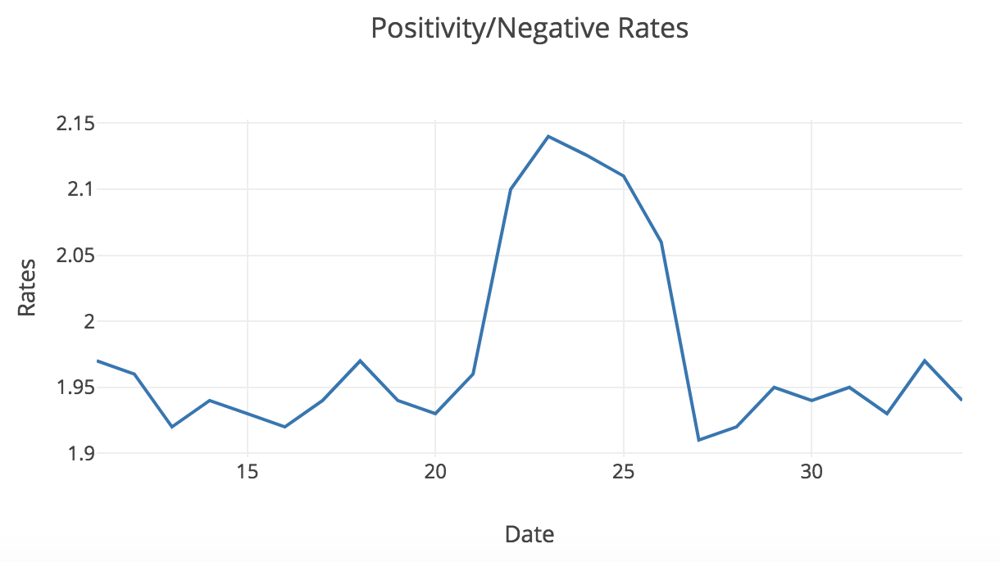
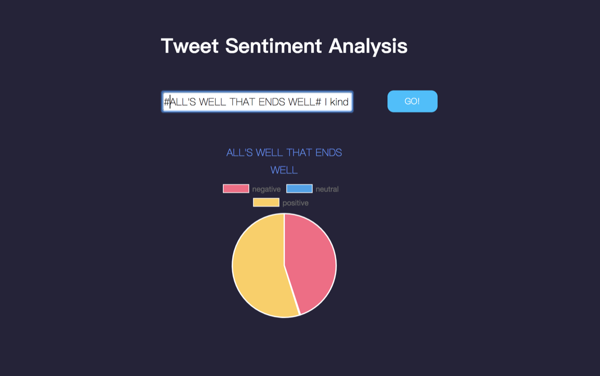

# Sentiment-Analysis
*In this project, we aim to explore how the Thanksgiving holiday affect individual’s mood. For the sake of simplicity, we are
choosing to only explore how people in California are affected by the holiday’s approach and passing. In addition, we want to see if an individual’s mood is affected by the day of the week and the outside temperature.*

Introduction
-----
Sentiment analysis, the automated extraction of emotional data from text or speech (Kharde & Sonawane, 2016), has long been
a favored tool for its ability to gauge consumers’ opinions and feelings en masse with minimal input from the analyst’s end. It is often performed on Twitter and Facebook data to gain insight into how the public views a particular brand or a political candidate, or to measure the trust placed into a particular financial stock (Feldman, 2013). As such, we feel that sentiment analysis would be the perfect tool for answering a sociological question such as ours.

We will first gather tweets from Twitter, which can serve as a proxy to individuals’ thoughts and the general public mood
(Bollen, 2011). Next, we will perform sentiment analysis on each tweet to determine whether it is happy or sad. Then, we will split the tweets up by date and tally up the number of happy and sad tweets for each day to determine how happy or sad individuals in different regions of California felt on each day in November. Finally, we will analyze the trends in the total numbers of happy and sad tweets and compare those trends with recent events to answer our question.

Result
------
To measure how happiness and sadness changed over time, we first split our unlabeled data set by day. For each day’s subset, we calculate the positivity rate (the ratio of the number of tweets classified as positive to the number of tweets classified as negative) from the testing data and from the data labelled by each of the three models. We also calculate the precision, recall, f-measure, and support for each subset. An excel sheet with these values for each data set is included with this report.

While the kNN model produced reasonable output, the logistic regression and SVM models did not yield usable data on the positivity rates. The logistic regression model predicted a ratio of 1 for all dates, while the SVM model either predicted 1 or an extraordinarily high ratio (of at least 1000). Thus, the rates from the logistic regression and SVM models are not shown. According to our testing data, the positivity rate peaked on November 24, with low points around the 11/16 and 12/4. However, the curve remained relatively smooth, suggesting that people’s overall mood did not seem to change too rapidly with current events.

According to the kNN model, the positivity rate experienced high peaks around 11/23, 11/26, and 12/1, and dipped considerably on 11/24 and 11/29. In general, the curve predicted by the kNN model varied wildly and did not follow the curve predicted by the testing data. This curve suggests that people were heavily influenced by current events.

Our goal in creating these predictors was to create a model to predict a Twitter user’s mood based on his or her tweet. With the model we create, we would then be able to feed in Tweets from a large number of users and find the mood of a large number of users. For our project specifically, we could use this data to observe how mood changes over time from before Thanksgiving to afterward. Furthermore, we could continue to use this model to observe how other major events affect the mood of people in an area.

Summary
-------
	•	Deployed a Twitter crawler using Twitter Streaming API to download tweets and processed these tweets to obtain readable information for fitting model
	•	Designed and trained fitting models using logistic regression, SVM and KNN approach
	•	Implemented experiment design and evaluation and compared the effectiveness of those approaches
	•	Analyzed the data and compared to determine the influence of Thanksgiving holiday on Californian’s moods 
File Information
---------
	File Stucture:

	crawlers:
		|--	clean.sh
		|--	process_json.py
		|--	process_tweet.py
		|--	twitter_streaming.py
		|--	twitter_user.py           // Stores credentials used to get tweets using Twitter's API
		|--	get_training_and_test.py  // Train and test involing
		|--	index.json		  // Emoji ratings JSON file
	bag_of_words:
		|--	moodbusters_reader.py
		|--	moodbusters_test.py
		|--	negative-words.txt
		|--	positive-words.txt
		run.sh
		test.py
		train.py

Web-application
------

